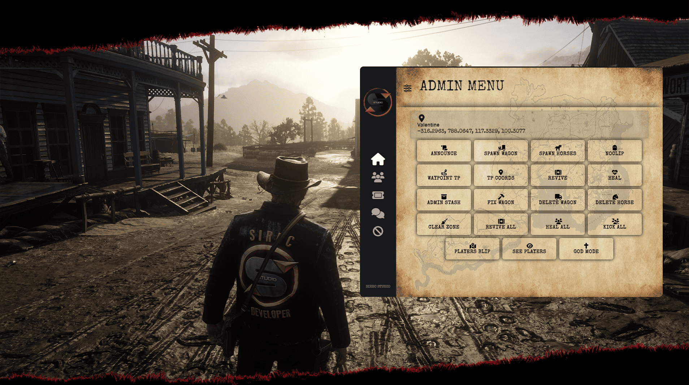

# SS-Admin

<figure><figcaption></figcaption></figure>

## Overview

**SS-Admin** is an advanced RedM administration panel for server staff. It provides a full NUI admin interface, player moderation tools, permission-based commands, ticket handling, admin chat, admin jail, ban and warn management, and support for both Discord role permissions and Steam identifier permissions.

The script is designed for live roleplay servers where staff need fast access to player actions, server tools, logs, tickets, and safety controls from one configurable panel.

## Main Features

* **Admin Panel Interface**
  * NUI admin panel with dashboard, player list, tickets, ban list, give item/weapon tools, wagon and horse tools, and admin chat.
  * Configurable button icons and translated UI labels.
  * Optional keybind opening and command-based opening.
* **Player Moderation Tools**
  * Revive, heal, freeze, kill, spectate, kick, warn, ban, unban, bring, goto, notify, cuff, and admin jail actions.
  * Temporary bans, permanent bans, warning limits, and automatic ban after max warnings.
  * Player death check support with detailed translated damage reasons.
* **Server & Utility Tools**
  * Noclip, god mode, waypoint teleport, coordinate teleport, player blips, nearby player visibility, clear zone, wagon repair/delete, horse delete, and admin stash.
  * Give money, gold, items, weapons, horses, and wagons.
  * Set job and open player inventory tools.
* **Ticket & Staff Communication**
  * Player report command with ticket list for staff.
  * Ticket status flow for new, taken, and solved tickets.
  * Admin chat inside the admin panel with configurable history size.
* **Permissions & Whitelist**
  * Discord role-based staff permissions.
  * Steam identifier-based staff permissions.
  * Optional Discord whitelist system.
  * Per-action permission indexes for admin, moderator, and helper categories.
* **Integrations**
  * Required integration with `SS-Core`.
  * Database storage through `oxmysql`.
  * Optional admin voice support through `pma-voice`.
  * Admin actions for `SS-Stable` horse tools and `SS-IdentityCard` identity creation/removal flows.
* **Multi-Language Support**
  * Lua translations and UI translations for multiple languages.
  * Default language support for `EN`, `RO`, `IT`, `DE`, `FR`, `ES`, and `PT`.
