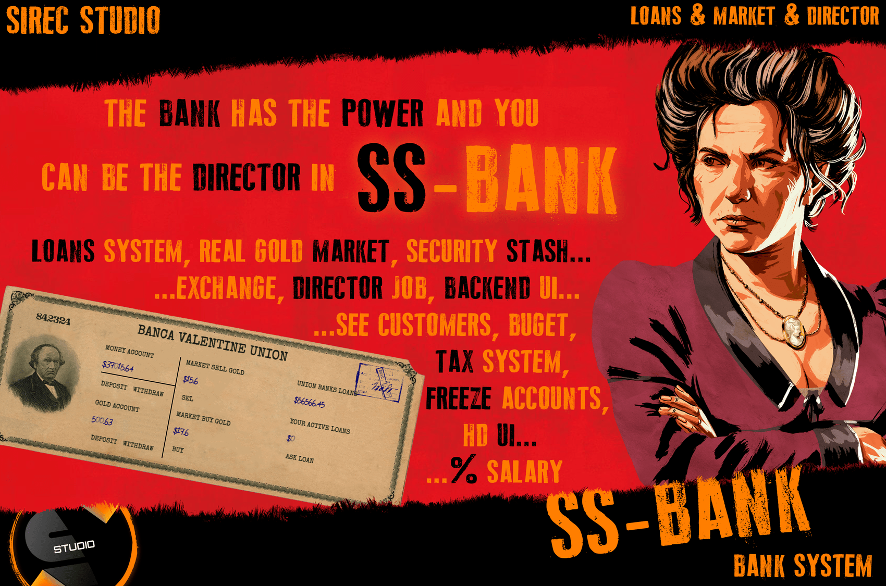

# SS-Bank


<figure><figcaption></figcaption></figure>

The _SS-Bank_ script offers robust banking features for players, including account management, loan processing, security settings, tax and salary options, and custom notifications. This guide provides a detailed explanation of each configuration setting to help you customize the bank’s functionality to suit your server.

#### 1. Basic Settings

*   **WebHook**: Set this to a webhook URL if you want to log transactions or other bank-related activities for auditing or administrative purposes.

    ```lua
    WebHook = ""  -- Example: "https://discord.com/api/webhooks/your-webhook-id"
    ```
*   **Dev Mode (Dev)**: Use `true` for testing on a development server and `false` for a live production environment.

    ```lua
    Dev = true  -- Options: true (testing) / false (live server)
    ```
*   **Language**: Sets the language of the bank interface. Check the `l/l.lua` file for available language options and use the relevant language code.

    ```lua
    Language = "EN"  -- Options: "EN", "RO", etc.
    ```

#### 2. Button Configuration

Define the buttons that players use to access different bank features:

* **BankButton**: Key/button used to open the main bank menu.
* **SecurityButton**: Key/button used to access the bank’s security stash.
* **ExchangeButton**: Key/button for accessing the gold bar exchange option.

Example setup:

```lua
BankButton = 0x760A9C6F
SecurityButton = 0x9959A6F0
ExchangeButton = 0xD9D0E1C0
```

#### 3. Bank Security and Features

*   **CanLock**: When `true`, the bank director can freeze a player’s account for security or administrative purposes.

    ```lua
    CanLock = true
    ```
*   **GoldBarItem**: Sets the item name for gold bars, which players can exchange in the bank for currency. Customize this based on your server’s economy.

    ```lua
    GoldBarItem = "goldbar"
    ```

#### 4. Taxation and Fees

* **UseTax**: Enables player taxation. When `true`, taxes are applied based on the configuration below.
* **TaxTime**: Defines the number of days between each tax application.
* **TaxPrice**: Sets the tax percentage applied to players' bank balances.
* **TaxWithdraw** and **TaxDeposit**: Apply additional tax percentages on withdrawal and deposit transactions, respectively.

Example configuration:

```lua
UseTax = true
TaxTime = 7  -- Taxes applied every 7 days
TaxPrice = 1  -- 1% tax on balances
TaxWithdraw = 1  -- 1% tax on withdrawals
TaxDeposit = 1  -- 1% tax on deposits
```

#### 5. Blacklist of Items

To prevent certain items from being deposited into the bank, you can use the `BlacklistItems` array. This is helpful for controlling illegal or restricted items within the bank system.

```lua
BlacklistItems = {"cigarette", "weed_leaves", "heroin", "opium", "morphine", "cigar", "joint", "weedbags", "hashish", "lockpick", "ammodynamite", "smallbomb", "bigbomb", "ammopoisonbottle", "handcuffs", "handcuffskey", "typhus_injection"}
```

#### 6. Loan Settings

This section controls loan eligibility and repayment options:

* **SSArchives** and **SSIdentityCard**: Set these to `true` if you want players to require a clean record (no dossiers) and an identity card to apply for a loan. Enable only if your server uses the _SS-Archives_ and _SS-IdentityCard_ scripts.
* **Jobs**: Only specific job roles can request loans. List eligible jobs in this array.
* **Fee**: The interest rate on loans. Set to the percentage a player must repay beyond the loan amount.
* **PayBacks**: Percentage of the loan amount deducted at each installment.
* **LoanTime**: Interval (in days) for each repayment.
* **MaxLoan**: Maximum amount players can borrow.

Example loan configuration:

```lua
Loans = {
    SSArchives = true,
    SSIdentityCard = true,
    Jobs = {"Sheriff", "Doctor", "Blacksmith"},
    Fee = 25,
    PayBacks = 20,
    LoanTime = 3,
    MaxLoan = 5000,
}
```

#### 7. Salaries

* **SalaryTime**: Interval (in minutes) at which players receive salaries.
* **DirectorSalary**: Percentage of the bank’s collected funds (from taxes and loans) allocated as a salary to the bank director.

Example:

```lua
SalaryTime = 60  -- Players receive salaries every 60 minutes
DirectorSalary = 0.5  -- Director receives 0.5% of the bank’s funds
```

#### 8. Bank Branches

Configure each bank location, defining its name, ID, position, director’s position, NPCs, and other properties.

* **Name**: Unique name for the bank branch.
* **Id**: ID of the bank, used with _SS-BankHeist_ if applicable.
* **Pos**: Coordinates for accessing the bank menu.
* **Director**: Coordinates for the director’s menu.
* **Job**: Job role assigned as the branch director.
* **Npc**: Specify an NPC for the bank clerk. Set to `false` if no NPC is used.
* **Blip**: Set a map blip for the bank. Use `false` to disable.
* **Distance**: Radius from the bank menu in which the player can interact with it.

Example branch setup:

```lua
luaCopia codiceBanks = {
    [1] = {
        Name = "Rhodes Union Bank",
        Id = 1,
        Pos = {1292.8, -1304.6, 76.1, -31.9},
        Director = {1288.1, -1309.5, 77.1},
        Job = "MayorRhodes",
        Npc = "s_m_m_bankclerk_01",
        Blip = -2128054417,
        Distance = 2.5,
    },
}
```

#### 9. Notifications

Customize the notification function to match your server’s system. The default setup uses `vorp:TipBottom` for displaying notifications.

```lua
function NOTIFY(text)
    TriggerEvent("vorp:TipBottom", text, 5000)  -- Notification displayed at the bottom for 5 seconds
end
```

***

By following this guide, you’ll be able to set up _SS-Bank_ with the features and restrictions that suit your server’s needs. The script allows for flexibility in terms of tax, loan, and salary configurations, and it integrates seamlessly with other _SS_ scripts for added functionality.
