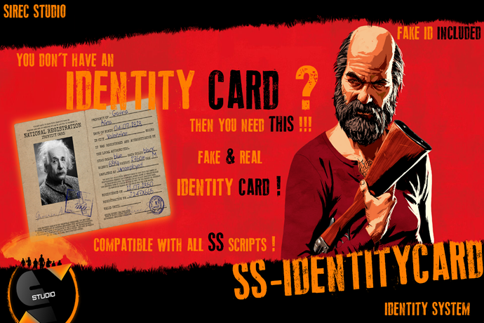

# SS-IdentityCard

<figure><figcaption></figcaption></figure>

**Overview**

**SS-IdentityCard** is a **fully customizable identity system** for FiveM, designed to integrate seamlessly into roleplay servers. This system allows players to **register their real or fake identity**, providing them with an **in-game ID card** that can be used for various roleplay interactions, police verifications, and business transactions.

With **support for fake identities**, immigration stamps, and seamless integration with **other SS scripts**, SS-IdentityCard enhances realism while allowing for unique RP scenarios such as **criminal identity forgery** or **law enforcement identity checks**.

* **Real & Fake Identity System**
  * Players can register a **real identity card** with their personal details.
  * **Fake IDs** are available, allowing players to assume a false identity.
  * Admin-configurable **limitations on fake IDs**, including **deletion restrictions** and costs.
* **Seamless Integration with SS Scripts**
  * Compatible with **SS-Archives** (for storing fines and legal records).
  * Works with **SS-Licenses**, **SS-Housing**, **SS-Boats**, **SS-TrainTransport**, and more.
  * Connects with **SS-MedicArchives**, allowing medical records to be linked to an ID.
* **In-Game Image Uploading**
  * Players can **upload or update** their ID photo directly in-game.
  * Custom server branding with **server name displayed on the ID**.
* **National Registration Offices**
  * **Multiple registration offices** available across major cities, including:
    * **Valentine**
    * **Blackwater**
    * **Rhodes**
    * **Saint Denis**
  * **Illegal ID services** available in certain locations for criminals.
* **Identity Card Management**
  * Players can **pay for a new ID**, request **copies**, or **update their information**.
  * **Admins can configure fees** for registrations, copies, and updates.
  * Police jobs can be configured to **view and verify** identity cards.
* **Fully Configurable and Optimized**
  * **Configurable menu keybind and layout** (`right` or `left` alignment).
  * **Blacklist jobs** (e.g., police, marshal) from appearing on ID cards.
  * **Server-specific birth years** and age limits.
  * **Police access restrictions** to ID verifications.
  * **Synced with in-game economy**, allowing ID payments to be redirected to police funds.

