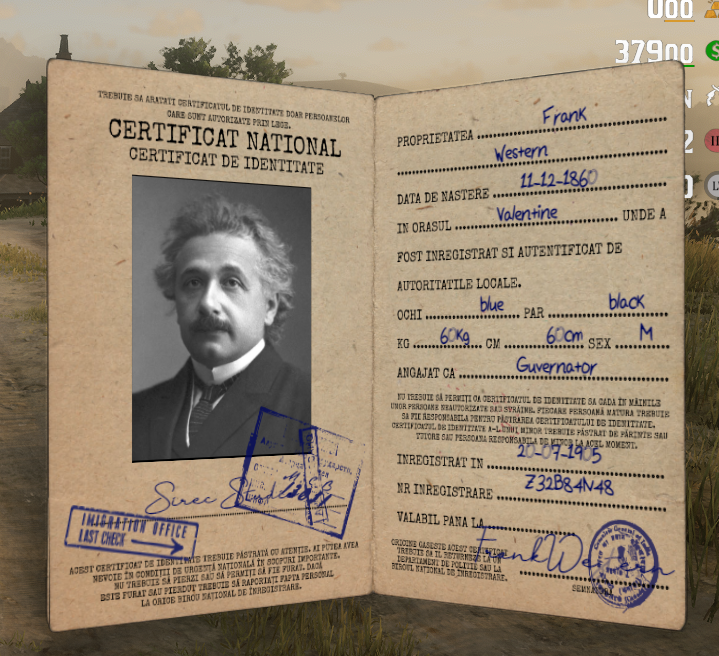

# SS-IdentityCard V4.4

## Update Summary

This update adds first-join registration compatibility with SS-JoinScene and introduces the immigration stamp system for servers that use Mexico, Guarma, or another territory as a separate state.

***

## Added

* Added compatibility with `SS-JoinScene`, allowing players to create their identity card when joining the server for the first time.
* Added immigration stamp support for servers that use Mexico, Guarma, or another location as a separate state.

***

## Immigration System

* Police can stamp a citizen's identity card with an `IN` or `OUT` status from the main state.
* Showing an identity card now displays the current immigration stamp.
* The stamp helps identify whether a citizen has entered or exited the main state.

***

## Preview

