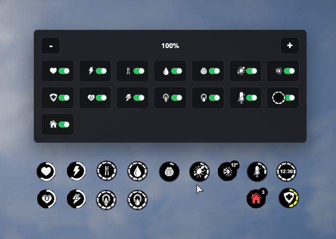
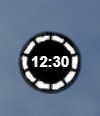
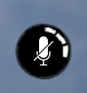
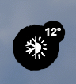

# SS-Metabolism V1.4

## Update Summary

SS-Metabolism keeps growing. Version 1.4 introduces a new HUD panel, icon scaling, icon visibility controls, new HUD icons, temperature display improvements, and several UI/code optimizations.

***

## Added

* Added a new HUD panel for icon management.
* Added support for up to 15 HUD icons.
* Added icon scaling, allowing players to make HUD icons bigger or smaller.
* Added hide/show controls for every HUD icon.
* Added clock display selection, allowing players to choose between digital and analog clock styles.
* Added direct HUD display for microphone and voice range.
* Added outside temperature display on the body hot/cold icon.

***

## Fixes & Improvements

* Fixed the screen moving up and down while repositioning HUD icons.
* Optimized HUD code.
* Applied UI fixes and cleanup for this release.

***

## UI & HUD

* Players can now personalize the HUD more deeply through the new panel.
* Icons can be scaled, hidden, shown, and arranged more cleanly.
* Voice, clock, and temperature information are now easier to read directly from the HUD.

***

## Preview

<figure><figcaption></figcaption></figure>

