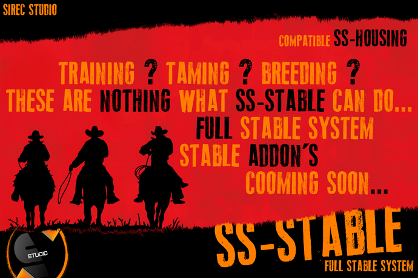

# SS-Stable

<figure><figcaption></figcaption></figure>

**Overview**

**SS-Stable** is the ultimate and most advanced stable management system for RedM, offering a complete suite of features for horse and wagon ownership, training, taming, breeding, equipment customization, selling, and more. Designed with immersion and realism in mind, this system transforms the way players interact with their horses and wagons, creating an unparalleled roleplay experience.

Whether you're running a large economy server or a smaller roleplay-focused community, SS-Stable provides the flexibility, depth, and performance to handle every aspect of stable life. From animated training routines and genetic-based breeding to an online marketplace and personal stables with individual inventories, every feature is carefully built to simulate a real horse world.

* **Complete Horse System**
  * Tame, train, and breed horses with custom EXP, age stages, and traits.
  * 7 horse life stages: Foal, Young, Training, Breedable, Adult, Old, Dead.
  * Breeding logic includes sex, age, race, and blacklist compatibility.
  * Foal gestation with configurable day-based stages (ride, train, adult).
* **Taming System**
  * Real reaction-based minigame to tame wild horses.
  * Taming tied to job roles and age requirements.
  * Horses can be sold or kept after successful taming.
  * Blacklist control for which horses can/cannot be tamed or sold.
* **Realistic Breeding System**
  * Cross-breeding allowed with 24 unique outcomes.
  * Gestation period, pregnancy penalties (stats), and newborn progression.
  * Inherits traits and race with configurable chance.
  * Full breeding blacklists per horse breed category.
* **Advanced Training**
  * Three training types: Steps, Action-based, and Manual Free Training.
  * Trainers gain EXP, with horses learning tricks at milestones.
  * EXP-based progression for stamina, speed, and abilities.
  * Job-lock for authorized training NPCs.
* **Horse Customization & Inventory**
  * Equip horses with saddles, bags, lanterns, masks, blankets, etc.
  * Full horse equipment menu with real stat effects (health, speed, etc.).
  * Save animal skins directly on horses.
  * Horseshoes system with KM-based durability and stat bonuses.
* **Wagon System**
  * Custom wagons with unique outfit/inventory slots.
  * Repair system using items and animations.
  * Wagon stash with drag & drop cargo, skins, and full interactions.
  * Wagon calling/sending restrictions based on cities/stables/housing.
* **Stable & Market Features**
  * Sell/buy/trade horses and wagons with full details and story.
  * Online horse market: players can sell horses even when offline.
  * Real in-game locations for stable services in multiple towns.
  * Job-locks for who can sell, tame, train, or access horse tools.
* **Key Extras**
  * Horse holster system.
  * Max horse ownership limits per player/group.
  * Blacklist control for selling/transferring specific breeds.
  * Unique camera previews for horses and wagons (360°).
  * Items and food with real-time stamina/health effects.
  * Legendary saddles, flaming horseshoes, extra stash bags, and much more.
  * Horses can protect their owner if trained (e.g., defend if cuffed or hogtied).
  * Realtime shared marketplace, even if owners are offline.
