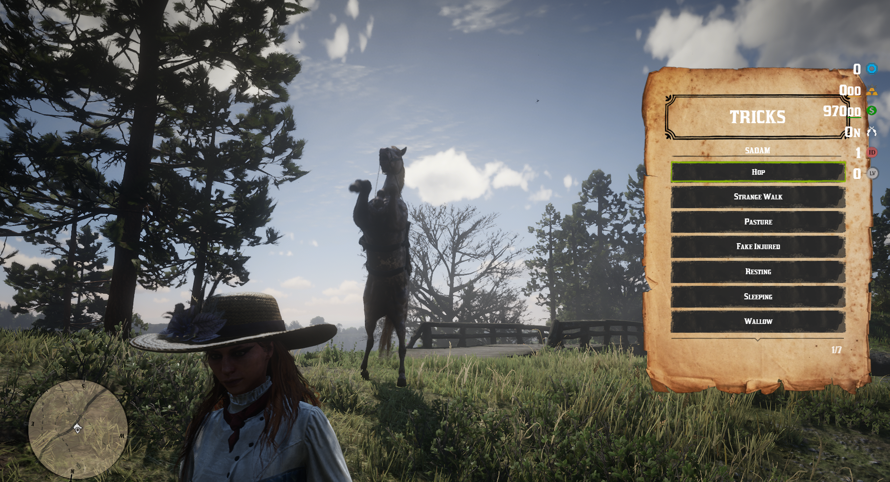
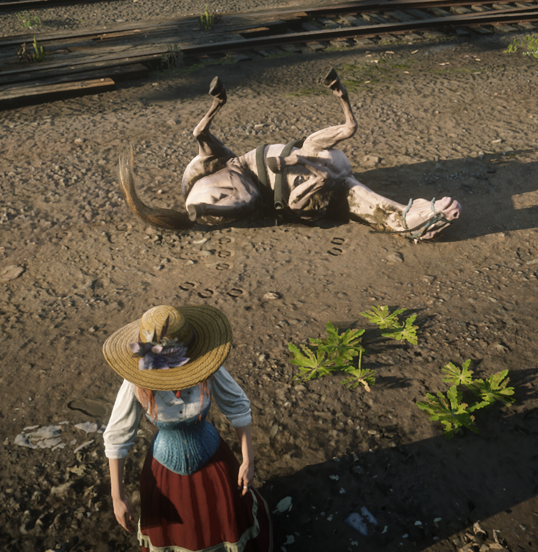

# Change logs

* **29/11/2024**
  * Has been added the horse tricks, wich you can active it by command, or by key (default is when you lock the horse and press B ) , you can add more tricks with experience needed to do that trick. Allow command, key or both !
  * Many reports that people add their horses in market with an high price, and they remain there for eternity :) . Now you can set the max market price by X 2...3.. of the horse price !
  * Has been removed the REPAIR with wheels etc etc, now will remain only on SS-WheelWright. Stable has only repair with hammer adding amount of health for every repair, scenario, animation, items need and amount can be set from config.
  * Has been added functions for SS-Admin ! ( Read on SS-Admin Update )
  * The config file has been re-organized and added more details about everything, so you or new customers can understand everything since Stable has many functions !

<figure><figcaption></figcaption></figure> <figure><figcaption></figcaption></figure>

