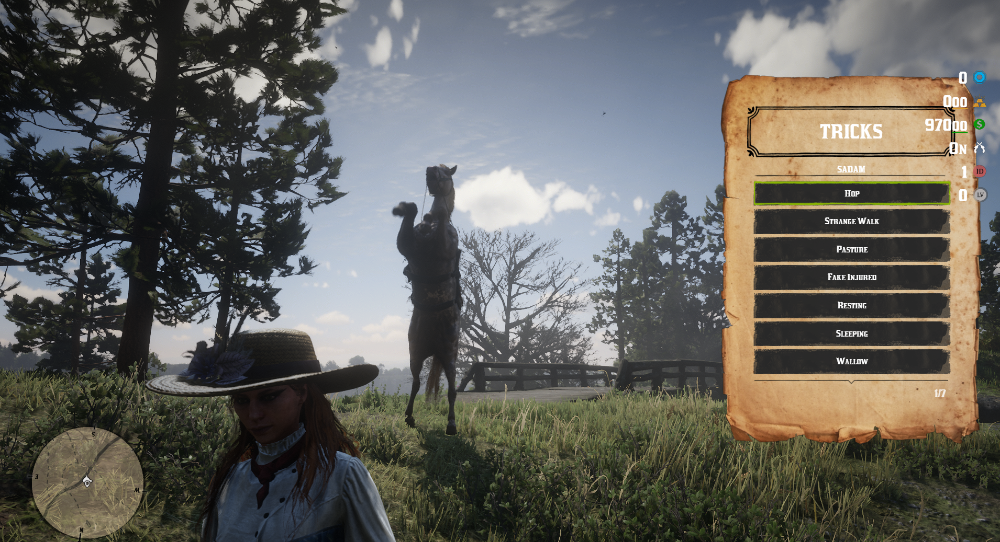
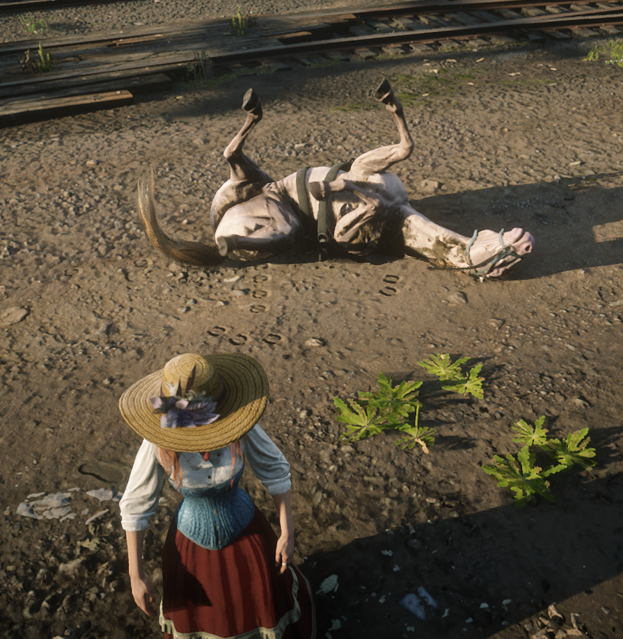

# SS-Stable V4.6

## Update Summary

This update focuses on bug fixes, stability, optimization, and cleaner configuration across multiple SS-Stable systems.

***

## Fixes & Improvements

* Optimized the horse and wagon preview system.
* Fixed incorrect stats displayed in the UI for market, my horses, and preview screens.
* Fixed horse equipment visually disappearing when switching categories in the shop or stable.
* Fixed crossbreed visuals so they are applied correctly in preview, my horse preview, and called horses.
* Fixed the horseshoe system so the item is reserved and consumed correctly, preventing duplication through fast transfers.
* Fixed animal quality when animals are placed into or removed from wagons, keeping the correct star quality.
* Fixed wagon repair so it starts directly when using the repair item near the wagon, without spawning an extra hammer prop.

***

## Added

* Added wagon blocking when the wagon is too damaged, configurable through `BlockWagonIfDamage`.
* Wagon stash, cargo, outfits, and tarpaulin actions are now blocked when the wagon is too damaged.

***

## Horse Equipment System

* Added a new system for the `horseequipment` item.
* Players can remove the main equipment from a personal horse and save it as item metadata.
* Players can apply saved equipment to another personal horse.
* The system works only inside stable zones.
* Mane, tail, mustache, and extra equipment are not included.
* Equipment cannot be applied to a horse that already has main equipment.
* Fixed `bags` updates after removing or applying horse equipment.
* Search bags and inventory now update correctly without needing to send away and recall the horse.

***

## Config & Translations

* Reorganized and documented `config.lua` and the files inside `cfg` more clearly.
* Grouped settings more logically by system, including general, horse, wagon, and related sections.
* Added and fixed missing translations.
* Removed extra or unused translations where needed.
* Prepared translations in the same style as SS-IdentityCard for `EN`, `IT`, `ES`, `FR`, `DE`, `PT`, `RU`, and `RO`.

***

## Stability & Performance

* Reduced the risk of runtime issues.
* Improved idle/active wait logic for prompts and UI behavior.
* Added more defensive checks for entities, models, metadata, and native calls.

***

## Previous V4.6 Notes

### New Features

* Added a new stamina experience control system. Horse stamina depletion and regeneration can now be adjusted with custom multipliers based on XP levels: under 1000 XP, over 1000 XP, over 2000 XP, over 3000 XP, and 4000 XP.
* Added 28 new custom horse coats, bringing the total number of custom coats to 54.
* Added horse tricks, which can be activated by command, by key, or by both. The default key behavior is triggered when the horse is locked and the player presses B.
* Added support for custom experience requirements on horse tricks, allowing each trick to require a specific XP level.
* Added SS-Admin functions. More details are available in the SS-Admin update.

### Fixes

* Fixed wagon repair so it correctly restores the entire wagon, including missing wheels.
* Fixed an issue where owned horse prices changed when scrolling through the owned horses list.

### Improvements

* Reworked the horse synchronization system. The old `-1` method, which synced to all players, caused major server overflow when calling or sending horses. It has been replaced with a new optimized sync system designed to prevent overflow.
* Optimized market refresh behavior. The market no longer auto-refreshes and now updates only when a player searches for horses near the market area, reducing unnecessary Client > Server and Server > Client data flow.
* Reorganized the config file and added more detailed explanations, making the setup easier to understand for both server owners and new customers.

### Changes

* Moved all translation strings out of `config.lua` into `translate/translate.lua`, keeping the configuration cleaner and more modular.
* Updated extra equipment support. A horse can now use up to 3 extra equipment items at the same time, such as extra stash, flaming horseshoes, and torch.
* Removed full wagon repair with wheels from SS-Stable. That repair flow now belongs to SS-WheelWright. SS-Stable keeps the hammer repair system, with configurable health amount, scenario, animation, required items, and item amount.
* Added a configurable maximum horse market price multiplier. This prevents players from listing horses at extremely high prices and leaving them on the market indefinitely.

### Preview

<figure><figcaption></figcaption></figure>

<figure><figcaption></figcaption></figure>
