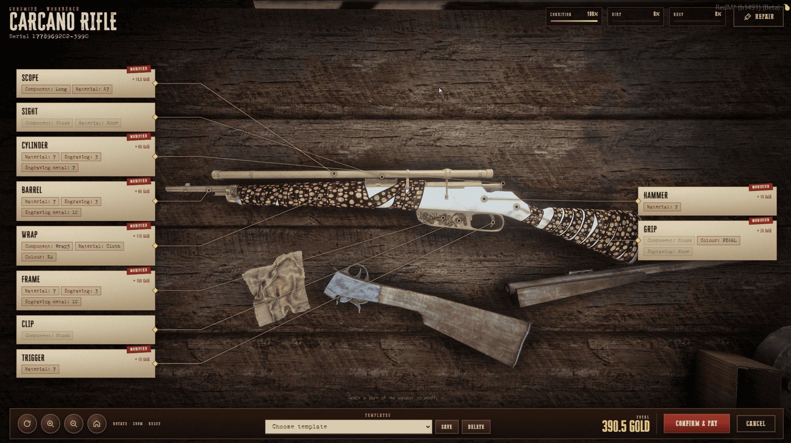

# SS-Weapons

**Overview**

**SS-Weapons** is a complete RedM weapon system: a vintage weapon and ammo catalogue, a blueprint-style gunsmith bench, weapon condition with cleaning and repair, weapon presets, an optional weapon HUD and a synced preview weapon, all in one configurable resource.

Players buy weapons and ammo from a parchment catalogue, customize supported weapons on a bench where every editable part is linked to the real weapon lying on the table, save customization templates, inspect condition, clean their weapons and repair permanent wear. Every purchase, edit and wear value is validated by the server.

* **Vintage Catalogue Store**
  * Category tabs, item list with thumbnails and prices, engraved illustration plate, description and stat bars per weapon.
  * Custom serial and custom weapon name (per store: paid option, hidden, or a forced store name), ammo quantity with live total.
  * Each store sells the whole catalogue or only selected weapons / ammo.
* **Blueprint Gunsmith Editor**
  * Top-down view of the preview weapon; every editable part gets a card connected to the exact spot on the weapon with a callout line.
  * Options drawer with component, material, engraving, engraving metal and colour tiles, priced per change; live preview; Condition / Dirt / Rust meters with a Repair button.
  * Rotate, zoom and reset the view; the preview is centred and framed automatically for every weapon.
  * Per-weapon presets (camera + callout positions) tuned in game and stored in `cfg/presets.json`.
  * One player per bench: a bench in use is locked for everyone else.
* **Per-Weapon Part Lists**
  * Cards exist only for parts the weapon really has; shared materials / engravings only for weapon families that accept them.
  * Bow frame / grip / string colours, blade materials and engravings, special skins.
* **Weapon Templates**
  * Save, apply and delete component setups per owner, character, weapon and template name.
* **Weapon Wear, Cleaning & Repair**
  * Dirt, soot, degradation, damage and permanent wear are saved per weapon serial in `ss_weapons`.
  * Cleaning uses the native weapon inspection flow with a configurable item; repair uses a repair kit and lowers permanent wear from the stored value.
  * Wear can only grow through play; a weapon can be blocked from firing at 100% permanent wear.
* **Weapon HUD & Preview Sync**
  * Optional weapon HUD with weapon image and ammo count, nine screen positions.
  * Nearby players can watch the gunsmith preview while someone edits it.
* **vorp\_inventory v1 & v2**
  * The inventory version is detected automatically and each version has its own equip logic.
* **Security**
  * Ownership, bench distance, jobs, prices, component payloads and wear values are checked server-side.
* **Catalog Data**
  * 57 weapon entries in `cfg/weapons.lua`, 44 ammo entries in `cfg/ammo.lua`, category-based browsing.
* **Multi-Language Support**
  * `EN`, `IT`, `ES`, `FR`, `DE`, `PT`, `RU`, `RO` for notifications and UI.
